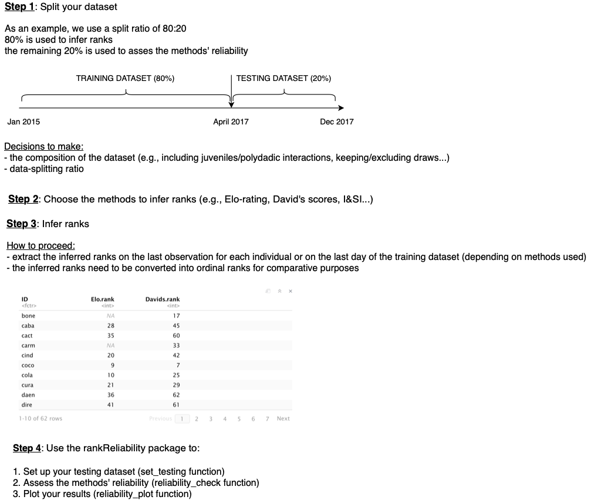
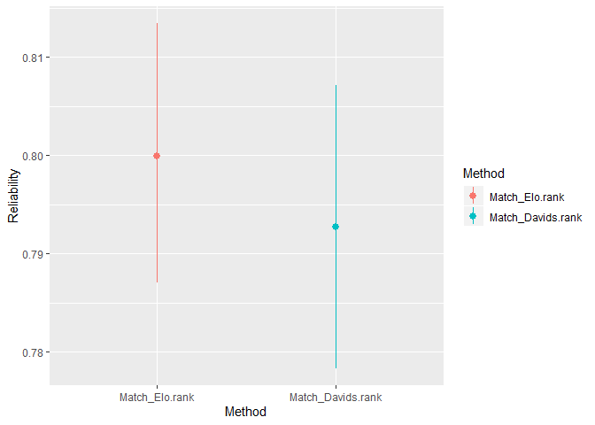
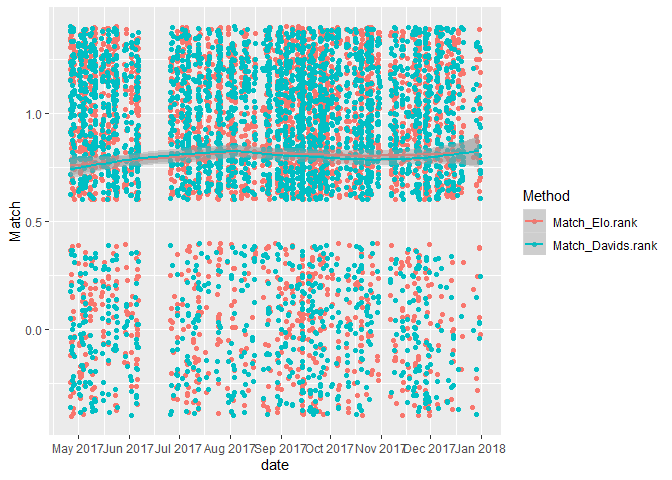

Rank Reliability
================

### **1. Introduction**

The rankReliability package allows the users to estimate how reliable their inferred ranks are through time. We used this approach as part of a study where the different ranking methods were compared, in order to find which best method fits best our own dataset.
We base our argument on the notion that if the inferred relative rank position of two animals can predict the outcome of a later aggressive interaction then we have good evidence to suggest that a method is reliable.

To do so we use a data-splitting approach (Figure 1, step 1). The training dataset (first split of the dataset) is used to infer the rank order. The second split of the dataset (called testing) is used to assess whether the calculated ranks/ratings reliably predict the outcome of aggressive dyadic encounters in this testing dataset.
This package only focuses on the testing dataset (i.e., once you have inferred your own ranks using your training datset), hence making it available to anyone, regardless the size of their dataset (Figure 1, step 4). The user is hence free to choose a certain preferred ranking-method, the split that fits the used dataset, as well as the composition of the dataset (e.g., including juveniles/polyadic interactions, keeping/excluding draws …). However we provide guidelines in Figure 1, to help the users get set up to use the package.
  
<br/><br/>

<!-- -->
  
Figure 1: General outline of how to use the rankReliability package.
  
<br/>  

Important: As of now, to make the different methods comparable we decided to convert scores into ordinal ranks so that the alpha individual gets the rank #1 and so on...).

<br/><br/>


### **2. rankReliability package**

This package presents 3 main functions:

**set\_testing:** helps you set up your testing dataset
  
**reliability\_check:** assesses how well ranks reliably predict future aggressive outcomes
  
**reliability\_plot:** plots the estimated reliability and its confidence
intervals, as well as jitter plot where the fitted (line with 95%
confidence interval) and observed (points) values of outcome
predictability are plotted as a function of time.

<br/>

#### Install rankReliability package and libraries.

``` r
#devtools::install_github("tbonne/rankReliability")
library(rankReliability)
library(lubridate)
```
<br/>

#### Function set\_testing

This function does two things. First, it uses the “result” column to
attribute who from the “from” or “to” column is the winner/loser.
Second, once you decided whether to keep or remove the ties present in
your testing dataset, it helps you set up the testing dataset by either
removing the ties or keeping them.
<br/>
This function needs to be fed a dataframe. One column should contain
dates/times (“date”). It should be in date format (e.g., ymd, or
ymd\_hms). The lubridate package can be helpful. Two other columns
should have the ID of the aggressor and the victim. Here the aggressor
column should be called “from” and the victim column “to”. Finally a
“result” column should be associated. Win = 1 - Loss =2 - Draw = 3.

``` r
#1. Take a look at the raw testing dataset
head(testing.raw)
```

    ##         date from   to result
    ## 1 2017-04-26 cola lore      1
    ## 2 2017-04-26 dori xavi      1
    ## 3 2017-04-26 egon phoe      1
    ## 4 2017-04-26 fina wood      1
    ## 5 2017-04-26 flyn sash      1
    ## 6 2017-04-26 flyn razo      1

<br/>

#### Apply set\_testing to our raw testing dataset

The function below takes as an input a dataframe and returns another
dataframe. This function requires to specify is ties = “remove” or
“keep”.

``` r
set.testing.data<-set_testing(testing.raw, ties="keep")

head(set.testing.data)
```

    ##         date winner loser result  draw
    ## 1 2017-04-26   cola  lore      1 FALSE
    ## 2 2017-04-26   dori  xavi      1 FALSE
    ## 3 2017-04-26   egon  phoe      1 FALSE
    ## 4 2017-04-26   fina  wood      1 FALSE
    ## 5 2017-04-26   flyn  sash      1 FALSE
    ## 6 2017-04-26   flyn  razo      1 FALSE

The output contains a date, winner, loser, result and draw columns. Note:
if you keep the ties, then the function automatically attribute IDs from
the “from” columns as winners. In case of draws, it doesn’t matter to
know who is the winner/loser as we consider that then the two
individuals should have the same ranks.

<br/>

#### Function reliability\_check

This function takes as an input two dataframes (df):

  - first, a df (df.rank) that contains the inferred ranks (previously
    inferred by you). This df should have the first column as an “ID”
    and the second column the “ranks” associated to each IDs. It is
    possible to add additional columns (with ranks calculated from
    different methods) in case you are interested in comparing the rank
    reliability across methods. This would help to choose the method
    that fits best the used dataset.

  - second, the set.testing.data (output of the set\_testing function)
    dataframe.

As an example, our df.rank contains two rank columns. The first one has
ranks calculated with the Elo-rating method (sequential ordering
approach) while the second has ranks calculated from the David’s scores
approach (matrix-based approach).

<br/>

#### Apply the reliability\_check function

``` r
reliability.df<-reliability_check(df.ranks,set.testing.data)
```

The function’s output is a list that contains: - a list of the ranks’
reliability and the confidence interval around the estimate - a list
that is a replica of the “set.testing.data” df with, in addition, a
“match” column that says whether or not the winner’s rank matched the
outcome of dyadic aggressive interactions in the testing dataset (yes =1
or no=0). In other words: if the winner of the interaction has a higher
rank than the loser then we attribute a 1.

Note: In case of tied interactions in the testing dataset, the outcome
was reliably predicted (=1) only if both individuals presented the same
rank.

<br/>

#### Store the function’s outputs in two distinct dataframes

Output 1: global reliability

``` r
global.reliability<-reliability.df[[1]]

head(global.reliability)
```

    ##              Method Reliability low.ci.boot high.ci.boot
    ## 1    Match_Elo.rank   0.7999341   0.7870798    0.8134476
    ## 2 Match_Davids.rank   0.7926829   0.7783364    0.8071935

Output 2: Predictions of future interactions

``` r
df.reliability<-reliability.df[[2]]

head(df.reliability)
```

    ##         date winner loser result  draw Match_Elo.rank Match_Davids.rank
    ## 1 2017-04-26   cola  lore      1 FALSE              1                 1
    ## 2 2017-04-26   dori  xavi      1 FALSE              0                 0
    ## 3 2017-04-26   egon  phoe      1 FALSE              1                 0
    ## 4 2017-04-26   fina  wood      1 FALSE              1                 1
    ## 5 2017-04-26   flyn  sash      1 FALSE              0                 0
    ## 6 2017-04-26   flyn  razo      1 FALSE              1                 1

<br/>

#### Function reliability\_plot

This function takes the reliability\_check function’s outputs as inputs,
which will have to be stored seperately (see above)

Again, the output of this function is a list that contains: - a graph
that plots the estimate (global rank reliability over the testing
dataset) and its confidence intervals. - a jitter plot that plots the
fitted (line with 95% confidence interval) and observed (points, from
the “match” column) values of outcome predictability as a function of
time. It allows the user to see any potential drops in the data
collection.

PS: make sure that the “date” column is in a date
format.

``` r
reliability.plots<-reliability_plot(global.reliability,df.reliability,method="loess")

#plot overall reliability of ranks
reliability.plots[[1]]
```

<!-- -->

``` r
#plot predictability of interactions over time
reliability.plots[[2]]
```

<!-- -->
